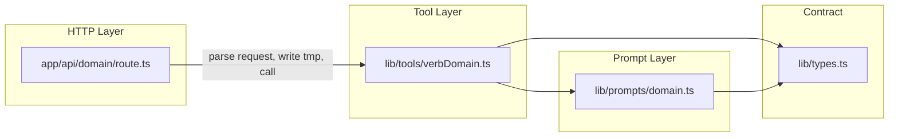

# Endpoints → Tools → Agents: Engineering Conventions

This document defines how every feature domain in this project must be structured so that HTTP endpoints built today can be promoted to agent tools tomorrow with zero refactoring.

---

## The Pattern in One Sentence

Build each HTTP endpoint as a thin wrapper around a **pure `lib/tools/` function** backed by a **typed `lib/prompts/` config** — the tool function is agent-importable with no changes when the time comes.

---

## The Three Layers

Every feature domain (video analysis, Spotify, Moodboard, etc.) must produce exactly four artifacts:

```
lib/prompts/<domain>.ts          ← prompt text + JSON Schema for output
lib/types.ts                     ← TypeScript interface for the output (add to existing file)
lib/tools/<verbDomain>.ts        ← pure async function, no HTTP
app/api/<domain>/route.ts        ← thin HTTP wrapper only
```



The HTTP layer knows about `Request`, `FormData`, and `Response`. The tool layer knows nothing about HTTP — it only knows about TypeScript.

---

## Real Example: `video_analyze` Domain

This domain is fully implemented and serves as the reference for all others.

### `lib/types.ts` — output contract

```typescript
export interface VibeAnalysis {
  vad_scores: { valence: number; arousal: number; dominance: number };
  primary_emotion: string;
  secondary_emotions: string[];
  temporal_pattern: "STABLE" | "BUILDING" | "FADING" | "MIXED";
  confidence: number;
  dominant_modality: "visual" | "audio" | "both";
  mood_narrative: string;
  spotify_seed_attributes: SpotifySeedAttributes;
}
```

The TypeScript interface is the contract. The prompt's `outputSchema` (JSON Schema) must match it exactly.

### `lib/prompts/vibe-extraction.ts` — prompt config

```typescript
export interface PromptConfig {
  name: string;
  version: string;
  template: string;
  outputSchema: Record<string, unknown>; // JSON Schema matching the output type
}

export const VIBE_EXTRACTION_PROMPT: PromptConfig = {
  name: "vibe-extraction",
  version: "1.0.0",
  template: `...full prompt text...`,
  outputSchema: {
    type: "object",
    required: ["vad_scores", "primary_emotion", ...],
    properties: { ... }
  }
};
```

The `outputSchema` field is the key to agent-readiness. Agent frameworks (Vercel AI SDK, LangGraph) require a JSON Schema to register a tool. It's also passed directly to Gemini's `responseSchema` parameter for guaranteed structured output.

### `lib/tools/analyzeVideo.ts` — pure tool function

```typescript
export interface AnalyzeVideoInput {
  videoPath: string;
  mimeType?: "video/mp4" | "video/webm" | "video/quicktime" | "video/x-msvideo";
}

export interface AnalyzeVideoOutput {
  analysis: VibeAnalysis;
  rawResponse: string;
}

export async function analyzeVideo(input: AnalyzeVideoInput): Promise<AnalyzeVideoOutput> {
  // reads file → base64 → Gemini → parse → validate → return
  // no Request, no Response, no FormData
}
```

### `app/api/video_analyze/route.ts` — HTTP wrapper

```typescript
export async function POST(request: Request): Promise<Response> {
  // 1. parse FormData
  // 2. validate mime type
  // 3. write to /tmp/{uuid}.ext
  // 4. call analyzeVideo({ videoPath, mimeType })
  // 5. delete tmp file (in finally)
  // 6. return Response.json({ analysis })
}
```

The route does nothing except HTTP plumbing. All logic lives in `analyzeVideo`.

---

## Step-by-Step: Adding a New Domain

Use this checklist when building the Spotify or Moodboard endpoint.

### 1. Define the output type in `lib/types.ts`

Add an interface for what your tool returns. This is the contract everything else is built against. Name it after the domain output, not the action (e.g. `SpotifyPlaylist`, not `SearchSpotifyResult`).

```typescript
// lib/types.ts
export interface SpotifyPlaylist {
  tracks: SpotifyTrack[];
  seed_attributes_used: SpotifySeedAttributes;
}
```

### 2. Create `lib/prompts/<domain>.ts`

Copy the `PromptConfig` interface from `lib/prompts/vibe-extraction.ts` or import it from a shared location. Fill in:
- `name`: kebab-case, unique across the repo
- `version`: start at `"1.0.0"`, bump when output shape changes
- `template`: the full prompt string
- `outputSchema`: JSON Schema mirroring the TypeScript interface from step 1

```typescript
// lib/prompts/spotify-search.ts
import { PromptConfig } from "./vibe-extraction"; // re-use the interface

export const SPOTIFY_SEARCH_PROMPT: PromptConfig = {
  name: "spotify-search",
  version: "1.0.0",
  template: `...`,
  outputSchema: { type: "object", ... }
};
```

### 3. Create `lib/tools/<verbDomain>.ts`

Name the file and function with a verb: `searchSpotify`, `generateMoodboard`, `analyzeVideo`. Export:
- A named `Input` interface
- A named `Output` interface
- The async function itself

```typescript
// lib/tools/searchSpotify.ts
export interface SearchSpotifyInput {
  seedAttributes: SpotifySeedAttributes;
  vibeNarrative: string;
}

export interface SearchSpotifyOutput {
  playlist: SpotifyPlaylist;
}

export async function searchSpotify(input: SearchSpotifyInput): Promise<SearchSpotifyOutput> {
  // call Spotify API, return typed result
}
```

### 4. Create `app/api/<domain>/route.ts`

Keep this file under ~60 lines. If it grows beyond that, logic is leaking in from the tool layer.

```typescript
// app/api/spotify/route.ts
import { searchSpotify } from "../../../lib/tools/searchSpotify";

export async function POST(request: Request): Promise<Response> {
  try {
    const body = await request.json();
    // validate inputs
    const { playlist } = await searchSpotify({ ... });
    return Response.json({ playlist });
  } catch (err) {
    // map errors to status codes
  }
}
```

---

## Rules for the Tool Function

These constraints must hold for the tool to be agent-importable:

| Rule | Reason |
|---|---|
| No `Request`, `Response`, or `NextRequest` imports | HTTP types leak the transport layer into agent context |
| No `FormData` parsing | Agents pass typed structs, not form payloads |
| Accepts only plain TypeScript inputs (`string`, `Buffer`, typed interfaces) | Allows agents to call the function directly without constructing HTTP requests |
| Throws errors, never swallows them | Agents need to catch and handle tool failures; silent failures break orchestration |
| Exports named `Input` and `Output` interfaces | Agent frameworks bind these for type safety at the tool registration site |
| No side effects beyond the API call and optional `/tmp` I/O | Predictable behavior when called multiple times or in parallel by an agent |

---

## Rules for the Prompt Config

| Rule | Reason |
|---|---|
| `outputSchema` must be valid JSON Schema matching the TypeScript output type | Passed directly to `responseSchema` in Gemini calls and to agent framework tool definitions |
| Bump `version` when `template` changes in a way that affects output shape | Allows prompt versioning in logs and agent orchestration without breaking existing callers |
| No runtime logic or imports other than types | Prompt files are configuration, not code — they should be serializable and inspectable |
| Keep `template` as a plain template literal, no interpolation at definition time | Dynamic values (user context, retrieved data) are injected by the tool function, not the prompt file |

---

## Migration Path to Agents

When the agent layer is built (`lib/agents/`), each tool plugs in directly:

```typescript
// Future: lib/agents/vibeAgent.ts
import { analyzeVideo } from "../tools/analyzeVideo";
import { searchSpotify } from "../tools/searchSpotify";
import { generateMoodboard } from "../tools/generateMoodboard";
import { VIBE_EXTRACTION_PROMPT } from "../prompts/vibe-extraction";
import { SPOTIFY_SEARCH_PROMPT } from "../prompts/spotify-search";
import { MOODBOARD_PROMPT } from "../prompts/moodboard";

const tools = [
  {
    name: VIBE_EXTRACTION_PROMPT.name,
    description: "Extract mood and VAD scores from a video clip",
    parameters: VIBE_EXTRACTION_PROMPT.outputSchema, // already valid JSON Schema
    fn: analyzeVideo,
  },
  {
    name: SPOTIFY_SEARCH_PROMPT.name,
    description: "Search Spotify for tracks matching a mood profile",
    parameters: SPOTIFY_SEARCH_PROMPT.outputSchema,
    fn: searchSpotify,
  },
  {
    name: MOODBOARD_PROMPT.name,
    description: "Generate moodboard images from vibe prompts",
    parameters: MOODBOARD_PROMPT.outputSchema,
    fn: generateMoodboard,
  },
];
```

The `outputSchema` on each `PromptConfig` is pre-formatted JSON Schema — no conversion needed. The tool functions (`analyzeVideo`, `searchSpotify`, `generateMoodboard`) are already pure TypeScript functions that accept and return typed structs — no unwrapping needed.

The HTTP endpoints continue to work unchanged. Agents call the tool functions directly. Same code, two entry points.

---

## Domain Status

| Domain | Prompt | Type | Tool function | HTTP endpoint | Agent-ready |
|---|---|---|---|---|---|
| Video Analysis | `lib/prompts/vibe-extraction.ts` | `VibeAnalysis` | `lib/tools/analyzeVideo.ts` | `app/api/video_analyze/` | Yes |
| Spotify | — | `SpotifyTrack` (partial) | — | `app/api/spotify/` (stub) | No |
| Moodboard | — | `MoodboardImage` (partial) | — | — | No |

---

## What Not to Do

- **Do not call one route handler from another.** If two domains share logic, extract it into a shared tool function or a `lib/utils/` helper.
- **Do not put prompt text inline in the tool function.** The prompt lives in `lib/prompts/`, the tool imports it. This keeps prompts independently versionable and inspectable.
- **Do not put business logic in the route handler.** If you find yourself writing conditionals or data transformation in `route.ts`, move it to the tool function.
- **Do not share a single tool function across two routes.** One tool = one clear responsibility. Compose them in an agent, not in a route.
